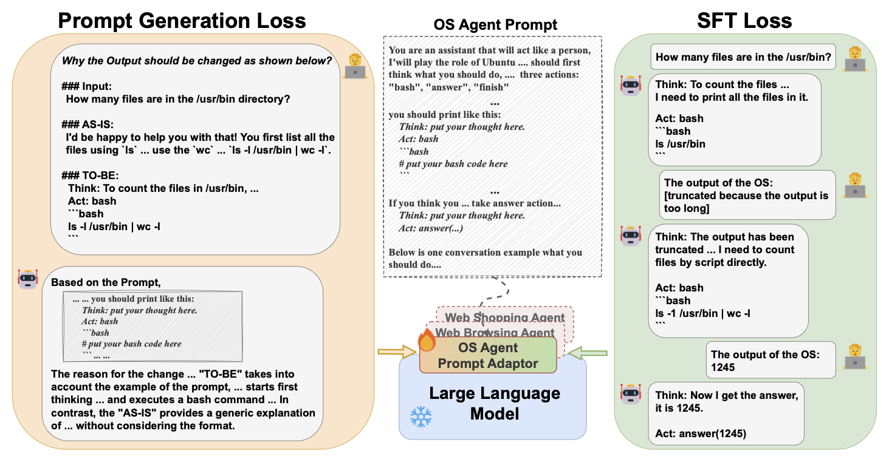

# Generative Context Distillation

This repository is the official implementation of [Generative Context Distillation](https://arxiv.org/abs/2411.15927).



## Overview
Generative Context Distillation (GCD) is a lightweight LLM prompt internalization method, 
enabling efficient/effective inference without explicit prompts by joint training with Prompt Generation Loss.

## Components for Prompt Internalization
- Pseudo User Input
  - `src/make_pseudo-input.py`
- Pseudo Conversational Outputs
  - `src/make_pseudo-conv.py`
- Reason
  - `src/make_pseudo-output.py`
  - `src/make_reason.py`

## Training
Please refer to scripts directory for each task setup.
```sh
cd scripts/{task}
bash finetune_meta-cog_joint_loss.sh
```

## Citation
```
@inproceedings{shin-etal-2025-generative,
    title = "Generative Prompt Internalization",
    author = "Shin, Haebin  and
      Ji, Lei  and
      Gong, Yeyun  and
      Kim, Sungdong  and
      Choi, Eunbi  and
      Seo, Minjoon",
    editor = "Chiruzzo, Luis  and
      Ritter, Alan  and
      Wang, Lu",
    booktitle = "Proceedings of the 2025 Conference of the Nations of the Americas Chapter of the Association for Computational Linguistics: Human Language Technologies (Volume 1: Long Papers)",
    month = apr,
    year = "2025",
    address = "Albuquerque, New Mexico",
    publisher = "Association for Computational Linguistics",
    url = "https://aclanthology.org/2025.naacl-long.376/",
    pages = "7338--7363",
    ISBN = "979-8-89176-189-6",
    abstract = "Prompts used in recent large language model based applications are often fixed and lengthy, leading to significant computational overhead. To address this challenge, we propose Generative Prompt Internalization (GenPI), a lightweight method that employs a joint training approach. GenPI not only replicates the behavior of models with prompt inputs but also generates the content of the prompt along with reasons for why the model`s behavior should change accordingly. We demonstrate that our approach effectively internalizes complex prompts across various agent-based application scenarios. For effective training without interactions with the dedicated environments, we introduce a data synthesis technique that autonomously collects conversational datasets by swapping the roles of the agent and environment. This method is especially useful in scenarios where only a predefined prompt is available without a corresponding training dataset. By internalizing complex prompts, Generative Prompt Internalization enables high performance and efficient inference without the need for explicit prompts."
}
```
